# **Abstract**

On January 1, 2013, DeepMind published a paper called "Playing Atari
with Deep Reinforcement Learning" introducing their algorithm called
Deep Q-Network (DQN) which revolutionized the field of reinforcement
learning. For the first time they had brought together Deep Learning and
Q-learning and showed impressive results applying deep reinforcement
learning to Atari games with their agents performing at or over human
level expertise in almost all the games trained on.  
A Deep Q-Network utilizes a deep neural network to estimate the q-values
for each action, allowing the policy to select the action with the
maximum q-values. This use of deep neural network to get q-values was
immensely superior to implementing q-table look-ups and widened the
applicability of q-learning to more complex reinforcement learning
environments.  
While revolutionary, the original version of DQN had a few problems,
especially its slow/inefficient learning process. Over these past 9
years, a few improved versions of DQNs have become popular. This project
is an attempt to study the effectiveness of a few of these DQN flavors,
what problems they solve and compare their performance in the same
reinforcement learning environment.

# Deep Q-Networks and its flavors

-   **Vanilla DQN**  
      
    The vanilla (original) DQN uses 2 neural networks: the **online**
    network and the **target** network. The online network is the main
    neural network that the agent uses to select the best action for a
    given state. The target neural network is usually a copy of the
    online network. It is used to get the "target" q-values for each
    action for a particular state. i.e. During the learning phase, since
    we don’t have actual ground truths for future q-values, these
    q-values from the target network will be used as labels optimize the
    network.

    The target network calculates the target q-values by using the
    following Bellman equation:
    
    ```math
    \begin{align}
    	Q(s_t, a_t) = 
    			r_{t+1} + \gamma \max _{a_{t+1} \in A} Q(s_{t+1}, a_{t+1}) 
        
    \end{align}
    ```
    
    where,  
    &nbsp;&nbsp;&nbsp;&nbsp;&nbsp;&nbsp; *Q*(*s*<sub>*t*</sub>,*a*<sub>*t*</sub>) = The target q-value
    (ground truth) for a past experience in the replay memory

    &nbsp;&nbsp;&nbsp;&nbsp;&nbsp;&nbsp; *r*<sub>*t* + 1</sub>= The reward that was obtained for taking the
    chosen action in that particular experience

    &nbsp;&nbsp;&nbsp;&nbsp;&nbsp;&nbsp; *γ*= The discount factor for future rewards

    &nbsp;&nbsp;&nbsp;&nbsp;&nbsp;&nbsp; *Q*(*s*<sub>*t* + 1</sub>,*a*<sub>*t* + 1</sub>) = The q-value for
    best action (based on the policy) for the next state for that
    particular experience

-   **Double DQN**  
      
    One of the problems with vanilla DQN is the way it calculates its
    target values (ground-truth). We can see from the bellman equation
    above that the target network uses the **max** q-value directly in
    the equation. This is found to almost always overestimate the
    q-value because using the **max** function introduces the
    maximization-bias to our estimates. Using max will give the largest
    value even if that specific max value was an outlier, thus skewing
    our estimates.  
    The Double DQN solves this problem by changing the original
    algorithm to the following:

    1.  Instead of using the **max** function, first use the online
        network to estimate the best action for the next state

    2.  Calculate target q-values for the next state for each possible
        action using the target network

    3.  From the q-values calculated by the target network, use the
        q-value of the action chosen in step 1.

    This can be represented by the following equation:
    ```math
    \begin{aligned}
    	Q(s_t, a_t) = 
    			r_{t+1} + \gamma Q_{target}(s_{t+1}, a'_{t+1})
        
    \end{aligned}
    ```
    
    where,
    ```math
    \begin{aligned}
    	a'_{t+1} = argmax({Q_{online}(s_{t+1})})
        
    \end{aligned}
    ```

-   **Dueling DQN**  
      
    The Dueling DQN algorithm was an attempt to improve upon the
    original DQN algorithm by changing the architecture of the neural
    network used in Deep Q-learning. The Duelling DQN algorithm splits
    the last layer of the DQN into to parts, a **value stream** and an
    **advantage stream**, the outputs of which are aggregated in an
    aggregating layer that gives the final q-value. One of the main
    problems with the original DQN algorithm was that the difference in
    Q-values for the actions were often very close. Thus, selecting the
    action with the max q-value might always not be the best action to
    take. The Dueling DQN attempts to mitigate this by using advantage,
    which is a measure of how better an action is compared to other
    actions for a given state. The value stream, on the other hand,
    learns how good/bad it is to be in a specific state. eg. Moving
    straight towards an obstacle in a racing game, being in the path of
    a projectile in Space Invaders, etc. Instead of learning to predict
    a single q-value, by separating into value and advantage streams
    helps the network generalize better.

    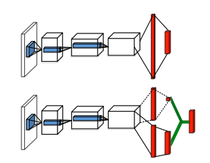  
    Fig: The Dueling DQN architecture (Image taken from the original
    paper by Wang et al.)

      
    The q-value in a Dueling DQN architecture is given by
    ```math
    \begin{aligned}
    	Q(s_t, a_t) = V(s_t) + A(a)
        
    \end{aligned}
    ```
    where,  
    &nbsp;&nbsp;&nbsp;&nbsp;&nbsp;&nbsp; V(s_t) = The value of the current state (how advantageous it is to
    be in that state)

    &nbsp;&nbsp;&nbsp;&nbsp;&nbsp;&nbsp; A(a) =The advantage of taking action an a at that state

    # About the project

    My original goal for the project was to train an agent using DQN to
    play **Airstriker Genesis**, a space shooting game and evaluate the
    same agent’s performance on another similar game called
    **Starpilot**. Unfortunately, I was unable to train a decent enough
    agent in the first game, which made it meaningless to evaluate it’s
    performance on yet another game.

    Because I still want to do the original project some time in the
    future, to prepare myself for that I thought it would be better to
    first learn in-depth about how Deep Q-Networks work, what their
    shortcomings are and how they can be improved. This, and for
    time-constraint reasons, I have changed my project for this class to
    a comparison of various DQN versions.

    # Dataset

    I used the excellent [Gym](https://github.com/openai/gym) library to
    run my environment. A total of 9 agents, 1 in Airstriker Genesis, 4
    in Starpilot and 4 in Lunar Lander were trained.

    | **Game**           | **Observation Space**                                                                                                                                                                                     | **Action Space**                                                                                                                                                                                                  |
    |:-------------------|:----------------------------------------------------------------------------------------------------------------------------------------------------------------------------------------------------------|:------------------------------------------------------------------------------------------------------------------------------------------------------------------------------------------------------------------|
    | Airstriker Genesis | RGB values of each pixel of the game screen (255, 255, 3)                                                                                                                                                 | Discrete(12) representing each of the buttons on the old Atari controllers. But since only three of those buttons were used in the game  the action space was reduced to 3 during training. ( Left, Right, Fire ) |
    | Starpilot          | RGB values of each pixel of the game screen (64, 64, 3)                                                                                                                                                   | Discrete(15) representing each of the button combos ( Left, Right, Up, Down, Up + Right, Up + Left, Down + Right, Down + Left, W, A, S, D, Q, E, Do nothing )                                                     |
    | Lunar Lander       | 8-dimensional vector: ( X-coordinate, Y-coordinate, Linear velocity in X, Linear Velocity in Y, Angle, Angular Velocity, Boolean (Leg 1 in contact with ground), Boolean (Leg 2 in contact with ground) ) | Discrete(4)( Do nothing, Fire left engine, Fire main engine, Fire right engine )                                                                                                                                  |

    **Environment/Libraries**:  
    Miniconda, Python 3.9, Gym, Pyorch, Numpy, Tensorboard on my
    personal Macbook Pro (M1)

    # ML Methodology

    Each agent was trained using DQN or one of its flavors. Each agent
    for a particular game was trained with the same hyperparameters with
    just the underlying algorithm different. The following metrics for
    each agent were used for evaluation:

    -   **Epsilon value over each episode** Shows what the exploration
        rate was at the end of each episode.

    -   **Average Q-value for the last 100 episodes** A measure of the
        average q-value (for the action chosen) for the last 100
        episodes.

    -   **Average length for the last 100 episodes** A measure of the
        average number of steps taken in each episode

    -   **Average loss for the last 100 episodes** A measure of loss
        during learning in the last 100 episodes (A Huber Loss was used)

    -   **Average reward for the last 100 episodes** A measure of the
        average reward the agent accumulated over the last 100 episodes

    ## Preprocessing

    For the Airstriker and the Starpilot games:

    1.  Changed each frame to grayscale  
        Since the color shouldn’t matter to the agent, I decided to
        change the RGB image to grayscale

    2.  Changed observation space shape from (height, width, channels)
        to (channels, height, width) to make it compatible with
        Pytorch  
        Apparently Pytorch uses a different format than the direct
        output of the gym environment. For this reason, I had to reshape
        each observation to match Pytorch’s scheme (this took me a very
        long time to figure out, but had an "Aha!" moment when I
        remember you saying something similar in class).

    3.  Framestacking  
        Instead of processing 1 frame at a time, process 4 frames at a
        time. This is because just 1 frame is not enough information for
        the agent to decide what action to take.

    For Lunar Lander, since the reward changes are very drastic (sudden
    +100, -100, +200) rewards, I experimented with Reward Clipping
    (clipping the rewards to \[-1, 1\] range) but this didn’t seem to
    make much difference in my agent’s performance.

# Results

-   **Airstriker Genesis**  
    The loss went down until about 5200 episodes but after that it
    stopped going down any further. Consequently the average reward the
    agent accumulated over the last 100 episodes pretty much plateaued
    after about 5000 episodes. On analysis, I noticed that my
    exploration rate at the end of the 7000th episode was still about
    0.65, which means that the agent was taking random actions more than
    half of the time. On hindsight, I feel like I should have trained
    more, at least until the epsilon value (exploration rate) completely
    decayed to 5%.  
    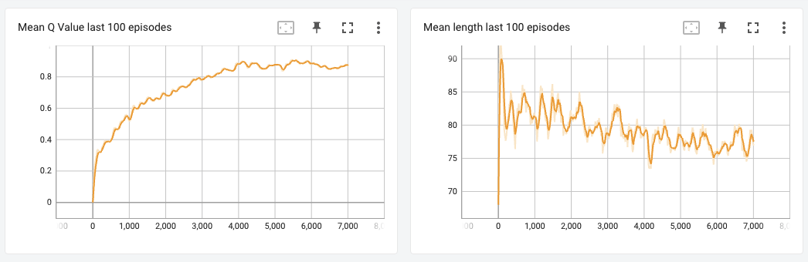 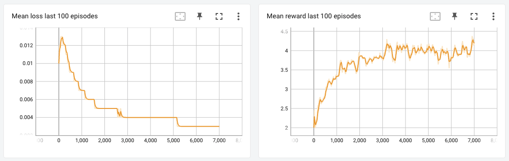 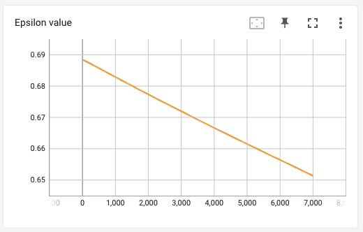  
      

-   **Starpilot**  
      
    I trained DQN, Double DQN, Dueling DQN and Dueling Double DQN
    versions for this game to compare the different algorithms.  
    From the graph of mean q-values, we can tell that the Vanilla DQN
    versions indeed give high q-values, and their Double-DQN couterparts
    give lower values, which makes me think that my implementation of
    the Double DQN algorithm was OK. I had expected the agent to
    accumulate higher rewards starting much earlier for the Double and
    Dueling versions, but since the average rewards was almost similar
    for all the agents, I could not notice any stark differences between
    the performance of each agent.  
      
    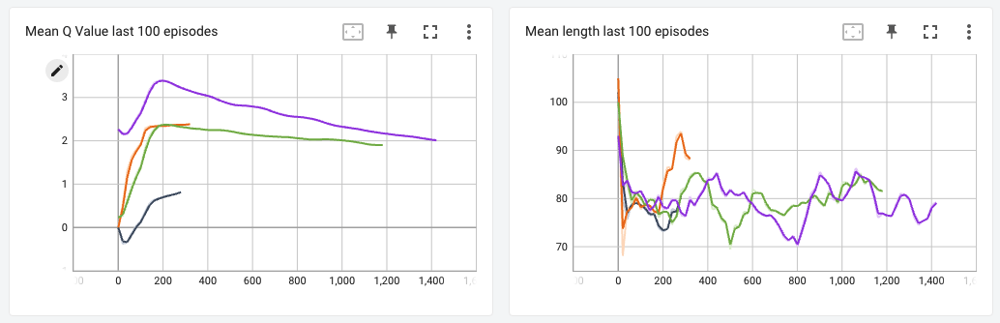  
      
    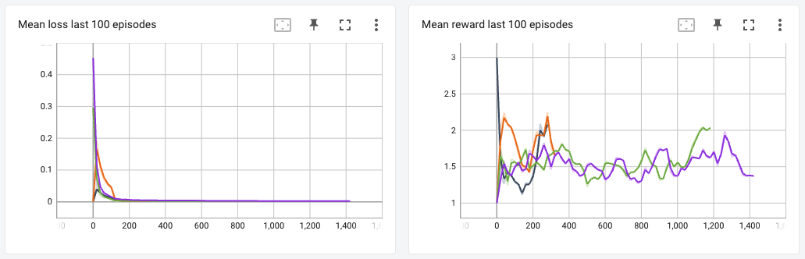

    <figure>
    <table>
    <tbody>
    <tr class="odd">
    <td style="text-align: left;">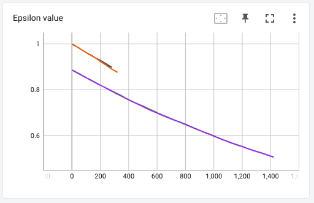</td>
    <td style="text-align: left;">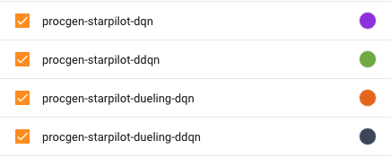</td>
    </tr>
    </tbody>
    </table>
    </figure>

-   **Lunar Lander**  
      
    Since I did gain much insight from the agent in the Starpilot game,
    I thought I was not training long enough. So I tried training the
    same agents on Lunar Lander, which is a comparatively simpler game
    with a smaller observation space and one that a DQN algorithm should
    be able converge pretty quickly to (based on comments by other
    people in the RL community).  
    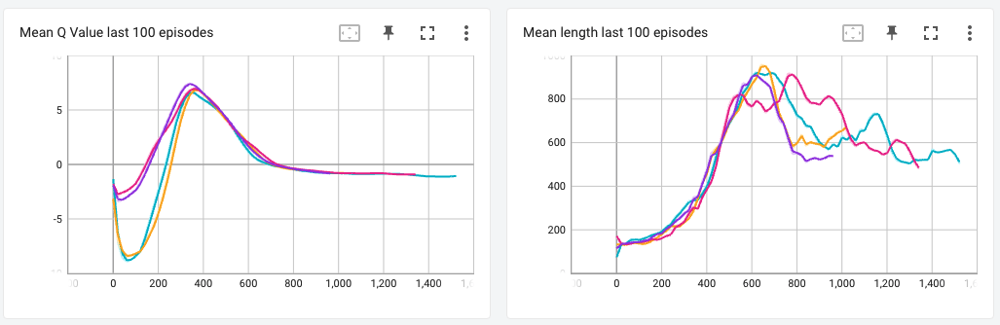  
      
    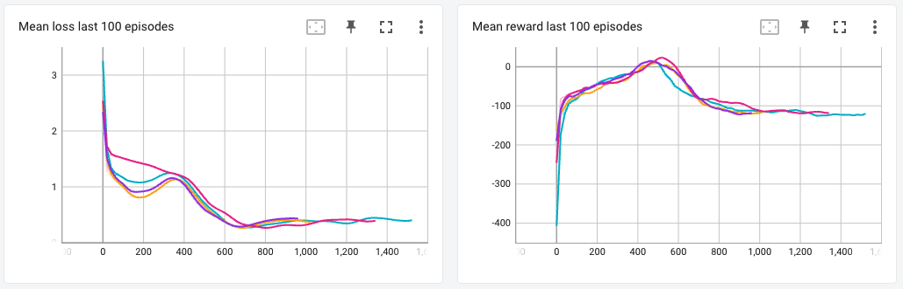

    <figure>
    <table>
    <tbody>
    <tr class="odd">
    <td style="text-align: left;">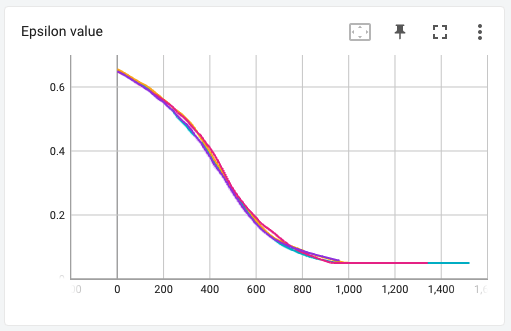</td>
    <td style="text-align: left;">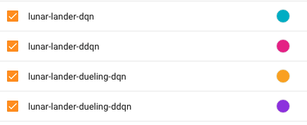</td>
    </tr>
    </tbody>
    </table>
    </figure>

      
    The results for this were interesting. Although I did not find any
    vast difference between the different variations of the DQN
    algorithm, I found that the performance of my agent suddenly got
    worse at around 300 episodes. Upon researching on why this may have
    happened, I learned that DQN agents suffer from **catastrophic
    forgetting** i.e. after training extensively, the network suddenly
    forgets what it has learned in the past and the starts performing
    worse. Initially, I thought this might have been the case, but since
    I haven’t trained long enough, and because all models started
    performing worse at almost exactly the same episode number, I think
    this might be a problem with my code or some hyperparameter that I
    used.

    Upon checking what the agent was doing in the actual game, I found
    that it was playing it very safe and just constantly hovering in the
    air, not attempting to land the spaceship (the goal of the agent is
    to land within the yellow flags). I thought maybe penalizing the
    rewards for taking too many steps in the episode would work, but
    that didn’t help either.

    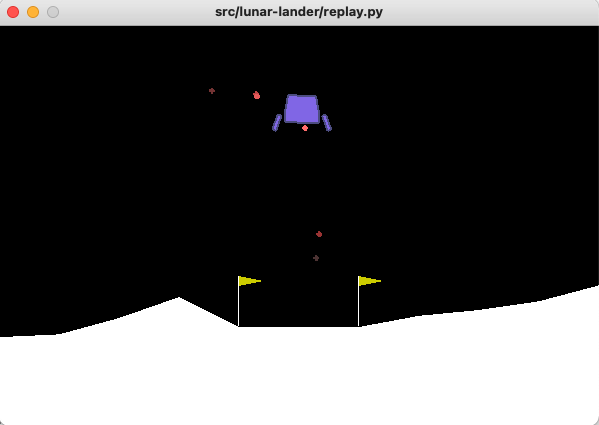

# Problems Faced

  
Here are a few of the problems that I faced while training my agents:

-   Understanding the various hyperparameters in the algorithm. DQN uses
    a lot of moving parts and thus, tuning each parameter was a
    difficult task. There were about 8 different hyperparameters (some
    correlated) that impacted the agent’s training performance. I
    struggled with understanding how each parameter impacted the agent
    and also with figuring out how to find optimal values for those. I
    ended up tuning them by trial and error.

-   I got stuck for a long time figuring out why my convolutional layer
    was not working. I didn’t realize that Pytorch has the channels in
    the first dimension, and because of that, I was passing huge numbers
    like 255 (the height of the image) into the input dimension for a
    Conv2D layer.

-   I struggled with knowing how long is long enough to realize that a
    model is not working. I trained a model on Airstriker Genesis for 14
    hours just to realize later that I had set a parameter incorrectly
    and had to retrain all over again.

# What Next?

Although I didn’t get a final working agent for any of the games I
tried, I feel like I have learned a lot about reinforcement learning,
especially about Deep Q-learning. I plan to improve upon this further,
and hopefully get an agent to go far into at least one of the games.
Next time, I will start with first debugging my current code and see if
I have any implementation mistakes. Then I will train them a lot longer
than I did this time and see if it works. While learning about the
different flavors of DQN, I also learned a little about NoisyNet DQN,
Rainbow-DQN and Prioritized Experience Replay. I couln’t implement these
for this project, but I would like to try them out some time soon.

# Lessons Learned

-   Reinforcement learning is a very challenging problem. It takes a
    substantially large amount of time to train, it is hard to debug and
    it is very difficult to tune its hyperparameters just right. It is a
    lot different from supervised learning in that there are no actual
    labels and thus, this makes optimization very difficult.

-   I tried training an agent on the Atari Airstriker Genesis and the
    procgen Starpilot game using just the CPU, but this took a very long
    time. This is understandable because the inputs are images and using
    a GPU would have been obviously better. Next time, I will definitely
    try using a GPU to make training faster.

-   Upon being faced with the problem of my agent not learning, I went
    into research mode and got to learn a lot about DQN and its improved
    versions. I am not a master of the algorithms yet (I have yet to get
    an agent to perform well in the game), but I feel like I understand
    how each version works.

-   Rather than just following someone’s tutorial, also reading the
    actual papers for that particular algorithm helped me understand the
    algorithm better and code it.

-   Doing this project reinforced into me that I love the concept of
    reinforcement learning. It has made me even more interested into
    exploring the field further and learn more.

# References / Resources

-   [Reinforcement Learning (DQN) Tutorial, Adam
    Paszke](https://pytorch.org/tutorials/intermediate/reinforcement_q_learning.html)

-   [Train a mario-playing RL agent, Yuansong Feng, Suraj Subramanian,
    Howard Wang, Steven
    Guo](https://pytorch.org/tutorials/intermediate/mario_rl_tutorial.html)

-   [About Double DQN, Dueling
    DQN](https://horomary.hatenablog.com/entry/2021/02/06/013412)

-   [Dueling Network Architecture for Deep Reinforcement Learning (Wang
    et al., 2015))](https://arxiv.org/abs/1511.06581)  
      
      
    *(Final source code for the project can be found*
    [*here*](https://github.com/00ber/ml-reinforcement-learning)*)*.
